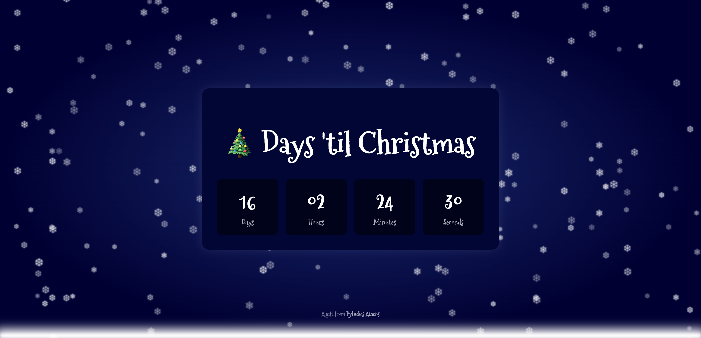

# 🎄 PyLadies Athens PyScript Χριστουγεννιάτικο Workshop

Σε αυτό το γιορτινό workshop θα μάθεις να φτιάχνεις ένα κινούμενο Christmas Countdown απευθείας στον browser σου, χρησιμοποιώντας Python και PyScript.

---

## Τελικό αποτέλεσμα

Μπορείτε να δείτε το τελικό αποτέλεσμα του workshop στον φάκελο `demo`. Μπορείτε επίσης να δείτε ένα [Live Demo](https://vadal.pyscriptapps.com/pyladies-athens-christmas-workshop-demo/latest/).




---
## Στόχος
Μέχρι το τέλος του workshop θα μπορείς να:
1. ✅ Χρησιμοποιείς **Python** για να υπολογίζεις τον χρόνο που απομένει μέχρι τα Χριστούγεννα.
2. ✅ Δημιουργείς **front-end animations** (π.χ. νιφάδες χιονιού) με Python και CSS.
3. ✅ Κατανοείς πώς η Python αλληλεπιδρά με τις ιστοσελίδες και τις «ζωντανεύει» !

## Πριν ξεκινήσεις
Πρόκειται για hands-on workshop. Βεβαιώσου ότι έχεις:
- 💻 Ένα laptop (προτείνεται Chrome ή Firefox browser).
- 📶 Πρόσβαση στο διαδίκτυο.

Θα χτίσουμε το project βήμα-βήμα. Δεν απαιτείται προηγούμενη εμπειρία σε web development!

## Πρόσβαση στον Web Editor του PyScript

Θα χρησιμοποιήσουμε τον επίσημο PyScript Editor, ένα browser-based playground όπου τρέχεις Python + HTML άμεσα, χωρίς εγκατάσταση.

- Μπες στο https://pyscript.com
- Κάνε sign-in με τον λογαριασμό που προτιμάς
- Επισκέψου το https://pyscript.com/dashboard
- Δημιούργησε νέο project
- Θα δεις τα αρχεία με τα οποία θα δουλέψουμε!

---

## Κατανόηση του Default Κώδικα

Όταν ανοίξεις για πρώτη φορά το PyScript IDE, το αρχείο `index.html` φαίνεται έτσι:

```html
<!DOCTYPE html>
<html lang="en">
<head>
    <title>Plain Base</title>

    <!-- Recommended meta tags -->
    <meta charset="UTF-8">
    <meta name="viewport" content="width=device-width,initial-scale=1.0">

    <!-- PyScript CSS -->
    <link rel="stylesheet" href="https://pyscript.net/releases/2025.11.1/core.css">

    <!-- This script tag bootstraps PyScript -->
    <script type="module" src="https://pyscript.net/releases/2025.11.1/core.js"></script>
</head>
<body>
    <script type="py" src="./main.py" config="./pyscript.toml" terminal></script>
</body>
</html>
```

Ας το δούμε βήμα-βήμα:
- Τα `<link>` και `<script>` μέσα στο `<head>` φορτώνουν το PyScript (CSS και JS) ώστε να τρέχει Python στον browser σου.
- Το `<script type="py" src="./main.py">` λέει στο PyScript να φορτώσει κώδικα Python από το `main.py`.
- Το `config="./pyscript.toml"` προαιρετικά φορτώνει τις ρυθμίσεις για την Python.
- To `terminal` εμφανίζει ένα Python terminal στο κάτω μέρος της σελίδας (χρήσιμο για debugging).

Δεν χρειάζεται να αλλάξεις τα default. Απλώς θα προσθέσεις το περιεχόμενό σου (countdown και styling) γύρω τους!

---

## Ροή Workshop

Θα οργανώσουμε τη δουλειά μας ανά αρχείο και ρόλο:

1. `index.html`: Η δομή και το στιλ της σελίδας.
2. `main.py`: Η λογική του countdown και το animation των νιφάδων.
3. CSS για να φαίνεται όμορφο.
4. Bonus προκλήσεις αν τελειώσεις νωρίς.

---

### Μέρος 1: Τροποποίηση HTML (index.html)
Το `index.html` είναι ήδη έτοιμο με τα απαραίτητα tags και το PyScript setup.
Άνοιξέ το και μέσα στο `<body>`, ακριβώς πάνω από τη γραμμή με το `<script type="py">`, πρόσθεσε:

```html
<div class="container">
    <h1>🎄 Days 'til Christmas</h1>
    <div id="countdown">
        <div class="timer-box">
            <div id="days" class="timer-value">0</div>
            <div class="timer-label">Days</div>
        </div>
        <div class="timer-box">
            <div id="hours" class="timer-value">0</div>
            <div class="timer-label">Hours</div>
        </div>
        <div class="timer-box">
            <div id="minutes" class="timer-value">0</div>
            <div class="timer-label">Minutes</div>
        </div>
        <div class="timer-box">
            <div id="seconds" class="timer-value">0</div>
            <div class="timer-label">Seconds</div>
        </div>
    </div>
</div>

<footer>
    <p>A gift from <a href="https://pyladies.com/athens-greece-local/" target="_blank">PyLadies Athens</a></p>
</footer>
<div id="snow-layer"></div>
```

Αυτό δημιουργεί το βασικό container για την αντίστροφη μέτρηση, την ίδια την αντίστροφη μέτρηση με κουτιά για τις ημέρες, τις ώρες, τα λεπτά και τα δευτερόλεπτα, ένα footer και ένα layer για το χιόνι.

#### Προσθήκη Γιορτινής Γραμματοσειράς
Για να κάνουμε την αντίστροφη μέτρηση πιο γιορτινή, θα χρησιμοποιήσουμε μια ειδική γραμματοσειρά από το Google Fonts που ονομάζεται "Mountains of Christmas". Πρόσθεσε τις ακόλουθες γραμμές μέσα στο tag `<head>` του αρχείου `index.html`:

```html
<!-- Google Fonts -->
<link rel="preconnect" href="https://fonts.googleapis.com">
<link rel="preconnect" href="https://fonts.gstatic.com" crossorigin>
<link href="https://fonts.googleapis.com/css2?family=Mountains+of+Christmas:wght@400;700&display=swap" rel="stylesheet">
```

Πάτησε **Save** και **▶ Run**. Το countdown ακόμα δεν λειτουργεί, αλλά το layout είναι έτοιμο.

---

### Μέρος 2: Python Λογική (main.py)
Άνοιξε το `main.py`.

Διάγραψε ό,τι υπάρχει και επικόλλησε βήμα-βήμα τον παρακάτω κώδικα:

#### A. Add the imports
Θα φορτώσουμε τα βασικά για να τρέχει η Python στον browser. 

```python
from datetime import datetime
from pyscript import display
from pyodide.ffi import create_proxy 
import js
import random
```
#### B. Προσθήκη ημερομηνίας Χριστουγέννων
```python
CHRISTMAS = datetime(2025, 12, 25, 0, 0, 0)
countdown_interval = None
```

#### C. Προσθήκη της λογικής για την αντίστροφη μέτρηση

Στη συνέχεια, ορίζουμε τη συνάρτηση που τρέχει κάθε δευτερόλεπτο, υπολογίζει τη διαφορά με την τωρινή ημερομηνία/ώρα και τη «σπάει» σε μέρες/ώρες/λεπτά/δευτερόλεπτα. Το αποτέλεσμα το εμφανίζει στα αντίστοιχα κουτιά.

```python
def calculate_countdown():
    global countdown_interval
    now = datetime.now()
    time_difference = CHRISTMAS - now
   
    if time_difference.total_seconds() <= 0:
        js.clearInterval(countdown_interval)
        container = js.document.querySelector('.container')
        container.innerHTML = "<h1>🎅 MERRY CHRISTMAS! 🎄</h1>"
        return 

    days = time_difference.days
    seconds_remainder = time_difference.seconds
    
    hours = seconds_remainder // 3600
    seconds_after_hours = seconds_remainder % 3600 
    
    minutes = seconds_after_hours // 60
    seconds = seconds_after_hours % 60
    
    js.document.getElementById('days').innerHTML = str(days)
    js.document.getElementById('hours').innerHTML = f"{hours:02}"
    js.document.getElementById('minutes').innerHTML = f"{minutes:02}"
    js.document.getElementById('seconds').innerHTML = f"{seconds:02}"
```
#### D. Προσθήκη λογικής για τις νιφάδες χιονιού

Αυτή η συνάρτηση δημιουργεί ένα νέο στοιχείο νιφάδας, του δίνει τυχαίες ιδιότητες (θέση, μέγεθος, ταχύτητα, αδιαφάνεια) και το εισάγει στο σώμα της σελίδας HTML. Θα ορίσουμε επίσης μια λίστα με εικονίδια νιφάδων για χρήση.

```python
# Μια λίστα από ωραίες νιφάδες (https://symbl.cc/en/unicode/blocks/dingbats/)
SNOWFLAKE_SVGS = [
    "&#10052;",  # ❄
    "&#10053;",  # ❅
    "&#10054;",  # ❆
]

def create_snowflake():
    # 1. Randomness for position, size, and speed
    start_left = random.randint(1, 99) # Random position (1 to 99)
    duration = random.randint(8, 20)   # Random speed in seconds (8 to 20)
    initial_opacity = random.uniform(0.5, 1) # Random initial opacity

    # 2. Create Element and Apply Styles
    snowflake = js.document.createElement("span")
    snowflake.className = "snowflake" # Applies base styles from <style>
    snowflake.innerHTML = random.choice(SNOWFLAKE_SVGS)

    # 3. Apply random CSS properties
    snowflake.style.left = f"{start_left}%"
    snowflake.style.opacity = initial_opacity
    snowflake.style.fontSize = f"{random.randint(15, 25)}px"


    # 4. Set the 'fall' animation with random speed, linking to our CSS @keyframes
    snowflake.style.animation = f"fall {duration}s linear infinite" 

    # 5. Inject into the body
    js.document.body.appendChild(snowflake)
```

#### E. Εκκίνηση των timers
Τέλος, σετάρουμε τους επαναλαμβανόμενους timers. Χρησιμοποιούμε το `create_proxy()` για να περάσουμε σωστά τις Python συναρτήσεις στο setInterval της JavaScript.

```python
# 1. Start Countdown Timer (1000ms = 1 second)
proxy_countdown = create_proxy(calculate_countdown)

# 2. Run the function immediately (so the display isn't delayed)
calculate_countdown()

# 3. Use the stable proxy with the native JS timer
countdown_interval = js.setInterval(proxy_countdown, 1000)

# 4. Start Snorflall Timer
proxy_snowflake = create_proxy(create_snowflake)
js.setInterval(proxy_snowflake, 300)
```

Πάτησε **Save** και **▶ Run**. Θα δεις το countdown να ανανεώνεται κάθε δευτερόλεπτο και τις ❄️να εμφανίζονται. Η εμφάνιση είναι ακόμα πολύ απλή.

### Μέρος 3: Προσθήκη CSS
Ας κάνουμε λίγο styling! Πήγαινε στο `index.html`, και μέσα στο `<head>`, πριν το `</head>`, πρόσθεσε:
```html
<style>
    body {
        background: radial-gradient(ellipse at center, #1a2a6c 0%, #000033 70%);
        color: white;
        min-height: 100vh;
        overflow: hidden;
        display: flex;
        flex-direction: column;
        justify-content: center;
        align-items: center;
        font-family: 'Mountains of Christmas', cursive;
    }

    .container {
        text-align: center;
        background: #020634;
        padding: 2rem;
        border-radius: 15px;
        box-shadow: 0 0 20px rgba(255, 255, 255, 0.1);
        position: relative;
        z-index: 1;
    }
    
    h1 {
        font-size: 4em;
        font-weight: 700;
        margin-bottom: 0.5em;
    }

    #countdown {
        display: flex;
        gap: 1rem;
    }

    .timer-box {
        background: rgba(0, 0, 0, .5);
        padding: 1rem;
        border-radius: 10px;
        min-width: 100px;
    }

    .timer-value {
        font-size: 3em;
        font-weight: 700;
    }

    .timer-label {
        font-size: 1em;
        font-weight: 400;
        color: rgba(255, 255, 255, 0.7);
    }
    
    footer {
        position: absolute;
        bottom: 30px;
        font-size: 0.8em;
        color: rgba(255, 255, 255, 0.5);
    }

    footer a {
        color: rgba(255, 255, 255, 0.7);
        text-decoration: none;
    }

    @keyframes fall {
        from {
            top: -10%; 
            opacity: 1;
        }
        to {
            top: 100%;
            opacity: 0;
        }
    }

    .snowflake {
        position: absolute;
        z-index: -1;
        filter: blur(1px);
    }

    #snow-layer {
        position: absolute;
        bottom: 0;
        left: 0;
        width: 100%;
        height: 10px;
        background: white;
        box-shadow: 0 0 20px 10px white;
        filter: blur(3px);
    }
</style>
```
Πάτησε ξανά **Save** και **▶ Run**. Η εφαρμογή σου θα δείχνει πια χειμωνιάτικη και γιορτινή ❄️.

---

**Συγχαρητήρια!** Ολοκλήρωσες το PyLadies Athens PyScript Christmas Workshop. Πλέον έχεις φτιάξει ένα πλήρως λειτουργικό animated countdown, φτιαγμένο εξ' ολοκλήρου με Python στον browser σου.

---
### Bonus Προκλήσεις (Προαιρετικές)

Αν έχεις χρόνο, δοκίμασε:

- 🎂 Άλλαξε το countdown στα γενέθλιά σου
- 🌈 Άλλαζε το background color κάθε 5 λεπτά με Python
- ⭐ Βάλε διαφορετικά emojis αντί για ❄️
- ⏱️ Δώσε τη δυνατότητα στον χρήστη να βάζει δική του ημερομηνία

---
### Troubleshooting
| Πρόβλημα                 | Tip                                                            |
|--------------------------|----------------------------------------------------------------|
| Δεν γίνεται τίποτα       | Έλεγξε αν πάτησες ▶ Run                                        |
| Το countdown δεν αλλάζει | Βεβαιώσου ότι η ημερομηνία είναι ακόμη στο μέλλον              |
| Δεν «πέφτουν» νιφάδες    | Έλεγξε τα CSS `@keyframes` και το στιλ της κλάσης `.snowflake` |